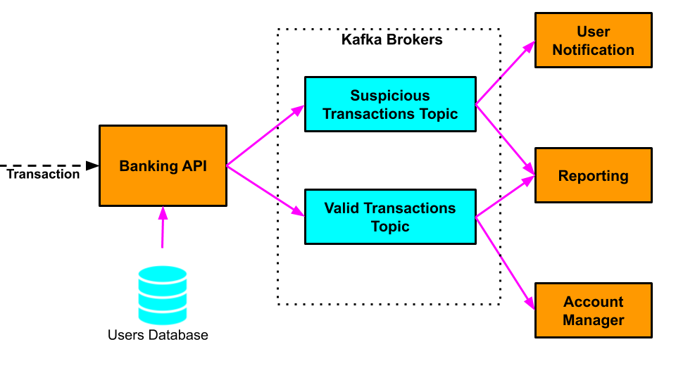

<h1 align="center">Distrubuted Systems</h1>

<a href="https://www.gmit.ie/" >
<p align="center">
</p></a>

# Kafka Assignment: Distributed Banking System

### GMIT BSc (Hons) Computing in Software Development

### Distributed Systems (COMP08011) 2020-21

<!-- ## Kafka Assignment: Distributed Banking System -->

## Introduction

A Distributed Banking System made up of several micro-services communicating via Kafka.
The system processes customer card transactions and identifies suspicious transactions so that customers can be
notified. Transactions are identified as being suspicious if the location of the transaction is different from the
customer's location.

## Architecture



The distributed banking system is made up of the following micro-services:

- **Banking API Service**: This is the entry point to the system. It receives customer card transactions from retailers
  and produces messages to the appropriate Kafka topics for processing by the other services. In a real system this
  would receive transactions from a front-end GUI application or another banking system. In our simplified version it
  reads customer transactions from a text file using the provided `IncomingTransactionsReader`.
  `IncomingTransactionsReader` provides methods similar to standard Java file IO to assist in reading customer
  transaction information:
    - `public boolean hasNext()`: return true if there is another transaction to read
    - `public Transaction next()`: reads the next transaction

  Each `Transaction` contains the following information:
    - _User_: the username of the user who made the purchase in that particular store
    - _Amount_: the amount of the purchase transaction
    - _Transaction Location_: the country in which the purchase transactions took place.

- **Customers Database**: A database where we store each of our bank customers' home location. In a real system this
  would connect to a real database. In our simplified version it reads customer address information from a text file
  using the provided `CustomerAddressDatabase`, which maps user names to address locations. `CustomerAddressDatabase`
  provides the method `public String getUserResidence(String user)`, which returns the address location for a given
  user.
- **User Notification Service**: receives notifications of suspicious transactions that require customer approval.
- **Account Manager Service**: receives notifications of valid transactions which can be processed normally (debit money
  from the customer's account to the stores account).
- **Reporting Service**:  receives notifications of all transactions received by the Banking API Service for further
  processing.

All the communication between these micro-services is achieved using Kafka Topics.

## Part 1 Kafka Cluster Setup

The distributed banking system communicates using a fault-tolerant and scalable Kafka cluster set up as follows:

- 3 Kafka brokers listening on ports 9092, 9093 and 9094
- A topic called `valid-transactions` with 3 partitions and a replication factor of 3.
- A topic called `suspicious-transactions` with 2 partitions and a replication factor of 3.

When set up correctly, the output of the `kafka-topics` script's `--describe` command for the two topics should look
something like this:

```
Topic: valid-transactions       PartitionCount: 3       ReplicationFactor: 3    Configs: segment.bytes=1073741824
        Topic: valid-transactions       Partition: 0    Leader: 1       Replicas: 1,0,2 Isr: 1,0,2
        Topic: valid-transactions       Partition: 1    Leader: 0       Replicas: 0,2,1 Isr: 0,2,1
        Topic: valid-transactions       Partition: 2    Leader: 2       Replicas: 2,1,0 Isr: 2,1,0
```

```
Topic: suspicious-transactions  PartitionCount: 2       ReplicationFactor: 3    Configs: segment.bytes=1073741824
          Topic: suspicious-transactions  Partition: 0    Leader: 2       Replicas: 2,0,1 Isr: 2,0,1
          Topic: suspicious-transactions  Partition: 1    Leader: 1       Replicas: 1,2,0 Isr: 1,2,0
```

## Part 2 - Implementation of the Distributed Banking System Micro-Services

Starter code was given for the micro-services with some parts of the functionality implemented. The task was
to complete the implementation of each service, as described below:

- `bank-api-service`
    - Processes customer transactions from a text file using the `IncomingTransactionsReader` class. Processing
      transactions involves:
        - Identifying the customer the transaction applies to using the `user` field of `Transaction`
        - Retrieving this customer's home address from the `CustomerAddressDatabase`.
        - Compare the transaction location with the customer's home address, and send a message to the appropriate Kafka
          topic:
            - If the locations match then it's a valid transaction and the message should be sent to
              the `valid -transactions` topic.
            - If the locations don't match then it's a suspicious transaction and the message should be sent to the
              `suspicious-transactions` topic.
        - The Kafka messages should have the following structure:
            - **Key**: user (_String_)
            - **Value**: Transaction
        - The classes `IncomingTransactionsReader`, `CustomerAddressDatabase`, and `Transaction` are provided for you.
          You'll need to complete the implementation of the `bank-api-service`.
- `user-notification-service`
    - Receives Kafka messages with information on suspicious transactions from the `suspicious-transactions` topic.
    - Prints suspicious transaction information to the screen.
    - You'll need to complete the implementation of this service.
- `account-manager`
    - Receives Kafka messages with information on valid transactions from the `valid-transactions` topic.
    - Prints valid transaction information to the screen.
    - You'll need to complete the implementation of this service.
- `reporting-service`
    - Receives Kafka messages with information on all transactions from the `valid-transactions`
      and `suspicious-transactions` topics.
    - Prints all transaction information to the screen, using a different message for suspicious and valid transactions.
    - You'll need to complete the implementation of this service.

## Kafka Cluster Setup


#### END OF README
